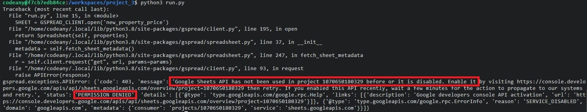
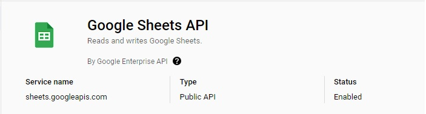

Welcome,

This is the Code Institute student template for deploying your third portfolio project, the Python command-line project. The last update to this file was: **March 14, 2023**

## Reminders

- Your code must be placed in the `run.py` file
- Your dependencies must be placed in the `requirements.txt` file
- Do not edit any of the other files or your code may not deploy properly

## Creating the Heroku app

When you create the app, you will need to add two buildpacks from the _Settings_ tab. The ordering is as follows:

1. `heroku/python`
2. `heroku/nodejs`

You must then create a _Config Var_ called `PORT`. Set this to `8000`

If you have credentials, such as in the Love Sandwiches project, you must create another _Config Var_ called `CREDS` and paste the JSON into the value field.

Connect your GitHub repository and deploy as normal.

## Constraints

The deployment terminal is set to 80 columns by 24 rows. That means that each line of text needs to be 80 characters or less otherwise it will be wrapped onto a second line.

---

Happy coding!

>#### __High level summary of issues encountered during App development:__

* __Errors and resolutions:__  

1. Project phase: Wiring up of APIs and confirmation of access to google sheet
 
 
API error code 403 - Permission denied for access to Google Sheets API. 
 
 
 
 
 
Resolution is provided in the error message to access weblink given and click 'Enable'. Once enabled, test was successful.
 
 
 
 
 

* __Maintenance:__   

* __Limitations:__  

* __Unfixed bugs:__  

  
 

## __User Stories:__

__User Story:__  
 
__User Story Testing:__   

##  __Features:__

## __Deployment:__

## __Credits:__

