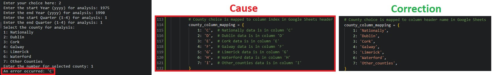
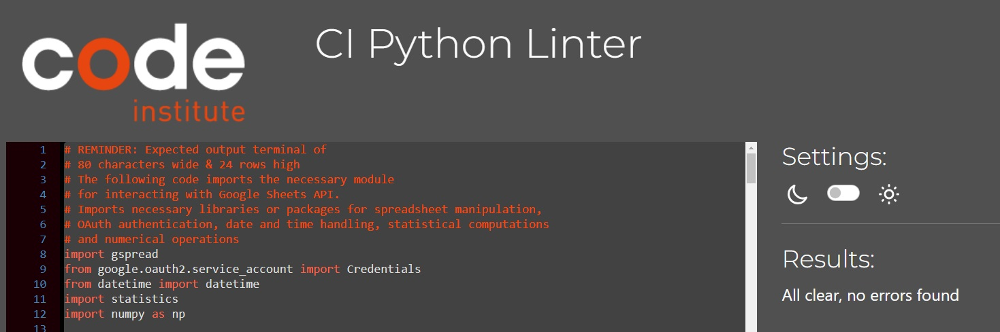

# __Project 3__

## __Introducing:__ 

__'Property Tracker'__ is an App for those who are nostaligic for the old freeware MS DOS days of simple Command Line Interfaces and fast answers to real world problems. Built with modern day Python, this Application's 'purpose in life' is to help you untangle the complexities of data analysis and our property market. Whether you're looking for your first new home, curious or seeking to venture into the property market as an investiment, this might just be the App for you!

Where the application's prowess lies not just in its historical analysis but in its dynamic nature. Recognizing the ever-changing real estate landscape, it was designed with the foresight to incorporate new, incoming data, allowing users to continually update and refine their understanding of current market trends.
 
 

 
 
 

### __Features: Gleaning Insights from Survey Results__

* __Importing Data:__ This application has imported data from the Central Statistics Office (CSO) specifically focused on the average new house price in Ireland and through a simple to use terminal allows users interaction with Google API Sheets, requiring no prior knowledge of data analysis to parse its content.

* __Parsing and Analyzing Data:__ Once the data is imported, the application offers robust parsing and analysis capabilities. Users can select specific time ranges (e.g. years and quarters) and regions (such as counties in Ireland) for detailed analysis. This functionality is crucial for dissecting the data to uncover trends, patterns, and anomalies in property prices over time.

* __Exporting Results:__ After analysis, the application provides an option to export the results into a text file. This feature is particularly useful for users who need to share findings, create reports, or simply archive data for future reference from their research.

* __Site Owner’s Goal:__ Providing Actionable Insights from an already inputted Dataset, its accessability is its strength, with no need to remember excel or various formala's to produce statistical summaries.  

* __Actionable Data Analysis:__ The application not only analyzes data but also presents it in a format that is easy to interpret and act upon. It calculates key statistical measures like average (mean), standard deviation, median, and quartiles, providing a comprehensive view of the housing market.

* __Adaptability to New Data:__ Recognizing the dynamic nature of the real estate market, the application is designed to incorporate new data. This ensures that the insights remain relevant and actionable.

* __User-Friendly Interface:__ With a clear menu and straightforward input prompts, the application is user-friendly, making it accessible to a wide range of users, regardless of their technical expertise.

* __Terminal Constraints:__
The application is designed to work within the constraints of a standard terminal (80 characters wide and 24 rows high), ensuring compatibility and ease of use across various systems.

In summary, this application effectively bridges the gap between raw data and actionable insights, catering to the needs of both external users seeking in-depth market analysis and site owners aiming to provide a valuable, user-centric tool.
 
 

## __Summary of issues encountered during Appication development:__

* ### __Issues:__ 
1. __API error code 403:__ Permission denied for access to Google Sheets API. 
 
 
 
 
 
Resolution is provided in the error message to access weblink given and click 'Enable'. Once enabled, test was successful.
 
 
 
 
 
2. __Terminal 80 x 24 line limitation:__
 
 

 
 
Correction of print() code to adjust for expected Terminal 80 x 24 line limitation: 

 
 
3. __Indentation Errors:__ Commonly caused by an issue with the whitespacing in the code. Indentation was used to define blocks of code that belong together. Where, the blocks of code under: __if__, __elif__, __else__, __try__, __except__, __for__, and __while__ statements had to be correctly indented to resolve the issue by ensuring all code blocks apart of a control structure were indented four spaces (or one tab) more than the control structure's statement.
 
 
4. __Missing Colons:__ Forgetting to put a colon (__:__) at the end of a statement that introduces a new block of code, like: __if__, __elif__, __else__, __for__, __while__, and __try__ statements.
 
 
5. __Incorrect Nesting:__ Blocks of code that were suppose to be nested within a loop or a conditional statement were not correctly indented, leading to unexpected behavior/syntax errors.
 
 
6. __Mismatched parentheses, brackets, or braces:__ Opening one without closing it (or vice versa) causing a syntax error. Which was resolved by ensuring every opening symbol had a corresponding closing symbol.
 
 
7. __Unmatched Quotes:__ Starting a string with a single quote (__'__) and ending it with a double quote (__"__) or not closing a string with a quote, which resulted in syntax errors.
 
 
8. __Improper Continuation of Code:__ Writing a statement that is supposed to be on one line over multiple lines without proper continuation, or continuing a line when it's not expected.
 
 
9. __Improper Indentation After Control Statements:__ After __if__, __else__, __for__, __while__, and __try__ blocks the subsequent code needed to be properly indented to indicate that it is part of that block.
 
 
10. __Incorrect use of Python Keywords:__ Accidentally attempting to use a Python keyword in an incorrect manner, i.e. naming a variable with a keyword, which resulted in a syntax error.
 
 
11. __Placement of Control Flow Statements:__ __continue__ statements were sometimes placed outside of the loop, which would cause a syntax error because it must be used inside the loops. 
 
 
13. __Error Handling:__ The except block was not correctly aligned with the corresponding try block due to indentation issues. Proper indentation was applied to align the except block with the try block.
 
 
14. __Confirmation Input Handling:__ Initially, the confirmation input only accepted a lowercase 'yes'. The code was modified to accept variations of 'yes' by using confirm.lower().startswith('y'), which allows for 'YES', 'Yes', 'Y', 'y', etc.
 
 
15. __Logical Flow:__ It was important to ensure that the logic of the program flows operated as originally intended. For instance, having the user validate their inputs by confirming the summarised data was correct before saving.
 
 
16. __Google Sheet Indexing error:__ 

 
 
17. __Make more frequent Github Commits:__ To ensure work is not lost. 
 
 
18. __Invalid format specifier:__ Indicated a problem with string formatting, specifically in this case, the formatting to with tables and user menu displays. Where the use of format specifiers inside curly braces {} in f-strings had incorrectly placed colon (:) or sometimes other items that Python didn't recognise which was triggering the error. 
 
 

### __Validator Testing:__  
- PEP8 Linter no errors   

 
 

### __Testing:__  
Manually tested the project via:
- Passing code through PEP8 Vaidator and addressing issues until there were no problems
- Tested valid and invalid inputs 
- Tested local terminal and in Heroku terminal

### __Unfixed bugs:__  
- No bugs remaining
 
 

### __Maintenance & Future features:__   
- Site designed to allow additional data be entered to enhance analysis
- Code has been clearly labelled to assist any other contributor
- Site was designed with expansion in mind, i.e. addition of used properties listings and rental properties
- Scope for inclusion of Graphics, e.g. Charts, etc. 
 
 

### __Limitations:__  
- The App's deployed to the Heroku environment prevents the creatiom of text files for exporting data analysis summaries. 
- Limited analytics 
 
 

## __Deployment:__
- Project was deployed using GitHub and Heroku mock terminal
- Steps for deplyment: 
    - Keep GitHub Repository up-to-date (with necessary requirements.txt)
    - Create a new Heroku App
    - Ensure settings are correct 
        - key: PORT and value: 8000
        - key: CREDS and value: Paste entire creds.json file contents here
    - Setup Buildbacks (in order) of Python and Node.Js 
    - Select and Confirm GitHub for Deployment method
    - Enable Automatic Deploys (or when relevant manually deploy via Deploy Branch)
    - Click View to visit mock terminal 
 
 

## __Credits:__
* Code Institute learning modules, templates (inc.README.md layout), Linter and Heroku deployment terminal 
* Data Camp, Zero To Mastery (ZTM), Python.org, ChatGPT and Google for background learning and troubleshoots 
* Department of Housing, Local Government, and Heritage. Price of new property by quarter. Central Statistical Office (CSO), 2016. Available at: https://data.gov.ie/dataset/price-of-new-property-by-quarter (License for this dataset allows users to share, ccopy and redistribute the material in any medium or format, in addition to adapt, transform, and build upon the material for any purpose, even commercially).
