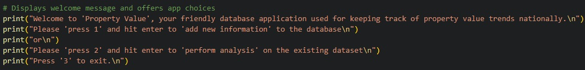
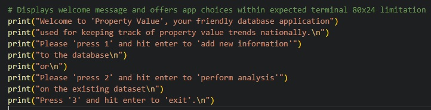

## __Summary of issues encountered during Appication development:__

* ### __Issues:__ 
1. __API error code 403:__ Permission denied for access to Google Sheets API. 
 
 
 
 
 
Resolution is provided in the error message to access weblink given and click 'Enable'. Once enabled, test was successful.
 
 
 
 
 
2. __Terminal 80 x 24 line limitation:__
 
 

 
 
Correction of print() code to adjust for expected Terminal 80 x 24 line limitation: 

 
 
3. __Indentation Errors:__ Commonly caused by an issue with the whitespacing in the code. Indentation was used to define blocks of code that belong together. Where, the blocks of code under: __if__, __elif__, __else__, __try__, __except__, __for__, and __while__ statements had to be correctly indented to resolve the issue by ensuring all code blocks apart of a control structure were indented four spaces (or one tab) more than the control structure's statement.
 
 
4. __Missing Colons:__ Forgetting to put a colon (__:__) at the end of a statement that introduces a new block of code, like: __if__, __elif__, __else__, __for__, __while__, and __try__ statements.
 
 
5. __Incorrect Nesting:__ Blocks of code that were suppose to be nested within a loop or a conditional statement were not correctly indented, leading to unexpected behavior/syntax errors.
 
 
6. __Mismatched parentheses, brackets, or braces:__ Opening one without closing it (or vice versa) causing a syntax error. Which was resolved by ensuring every opening symbol had a corresponding closing symbol.
 
 
7. __Unmatched Quotes:__ Starting a string with a single quote (__'__) and ending it with a double quote (__"__) or not closing a string with a quote, which resulted in syntax errors.
 
 
8. __Improper Continuation of Code:__ Writing a statement that is supposed to be on one line over multiple lines without proper continuation, or continuing a line when it's not expected.
 
 
9. __Improper Indentation After Control Statements:__ After __if__, __else__, __for__, __while__, and __try__ blocks the subsequent code needed to be properly indented to indicate that it is part of that block.
 
 
10. __Incorrect use of Python Keywords:__ Accidentally attempting to use a Python keyword in an incorrect manner, i.e. naming a variable with a keyword, which resulted in a syntax error.
 
 
11. __Placement of Control Flow Statements:__ __continue__ statements were sometimes placed outside of the loop, which would cause a syntax error because it must be used inside the loops. 
 
 
13. __Error Handling:__ The except block was not correctly aligned with the corresponding try block due to indentation issues. Proper indentation was applied to align the except block with the try block.
 
 
14. __Confirmation Input Handling:__ Initially, the confirmation input only accepted a lowercase 'yes'. The code was modified to accept variations of 'yes' by using confirm.lower().startswith('y'), which allows for 'YES', 'Yes', 'Y', 'y', etc.
 
 
15. __Logical Flow:__ It was important to ensure that the logic of the program flows operated as originally intended. For instance, having the user validate their inputs by confirming the summarised data was correct before saving.
 
 

* ### __Maintenance:__   
 
 

* ### __Limitations:__  
 
 

* ### __Unfixed bugs:__  
 
 

## __User Stories:__
 
 

__User Story:__  
 
 

 __User Story Testing:__   
 
 

##  __Features:__
 
 

## __Deployment:__
 
 

## __Credits:__
 
 

